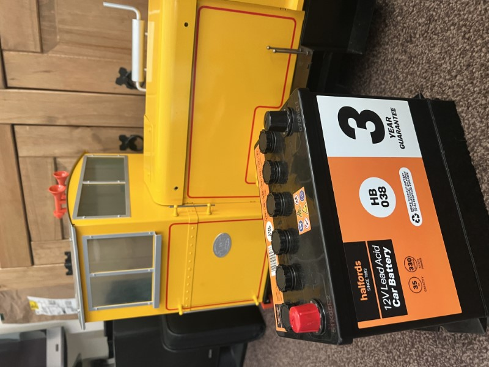

:::danger
Before connecting the battery ensure that the breaker is in the OFF position
**The breaker is located under the cab.**
:::

### Introduction

The battery currently installed in the loco is a *Halfords HB038 Lead Acid 12V Car Battery* available [here](https://www.halfords.com/motoring/batteries/car-batteries/halfords-hb038-lead-acid-12v-car-battery-3-year-guarantee-953034.html)

1A is 1 Amp which could be described as the flow of electricity. The battery used on the loco has a total capacity of 35 Amp Hours which means that when fully charged it can deliver 1 amp for 35 hours or 10 amps for 3.5 etc. 

With the above in mind in theory it will take 35 hours for a 1A charger to fully charge the battery, see the specifications section of this document which shows the recommended charge rate of the battery. 

### Charging

### Connecting the battery 

### Specifications

- **Startup Power:** 330Amps
- **Capacity:** 35Ah
- **Reserve Capacity:** 45Amps
- **Charge Rate:** 2Amps
- **Average Weight:** 11.10kg
- **Dimensions (LxDxH):** 238x135x202mm