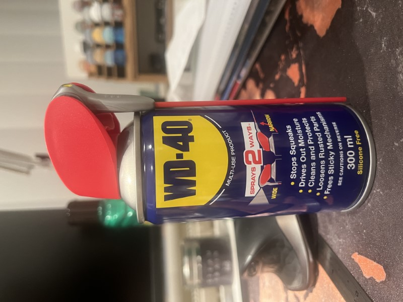

It is important that the body work of the engine is maintained regularly, this will stop the paint from becoming damaged over time and also ensure that the body is free from dirt and grime that will ultimately cause corrosion and damage to the paint. 

### WD40

WD40 can be used directly on the loco after use, this will assist with removing any grime from the paint work, once the initial cleaning is complete a dry rag should be used to clean the loco's body work and ensure that it is free from any oils. 

### Wax

Wax can be applied to the body work using the directions on the bottle of the provided wax. Banana Castle is currently treated with Turtle Wax

- This can be applied to the loco's body in circular motions
- Leave the wax dry directly on the engine until a film is formed 
- With a clean rag remove the wax in a circular motion which should leave the body in a shiny state. 

