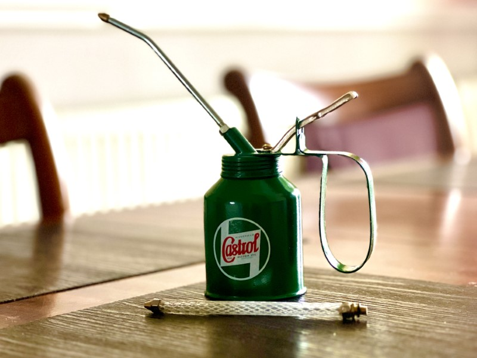
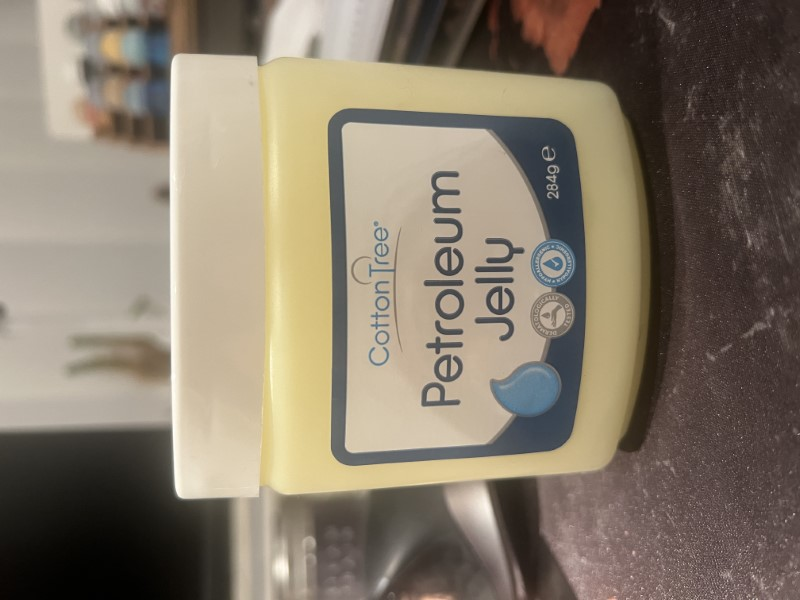
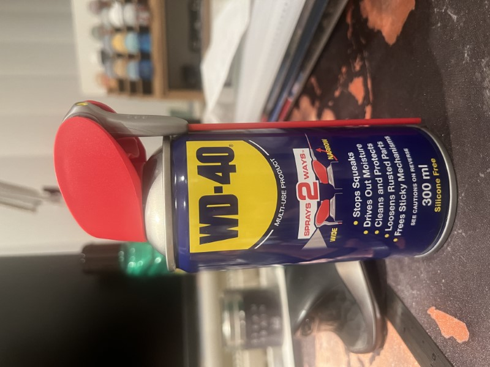

Oil should be applied to the bearings, both front and back of the loco 220 bearing oil is available in the Castrol oil can and should be applied before running. 

The Petrolium Jelly should be applied to the gearing before running.

WD40 can be applied to the entire loco body after running, if the loco is wet when it comes off the track it must first be dried, the WD40 can be left to stand on the body, this forms a protection to the paintwork. 

