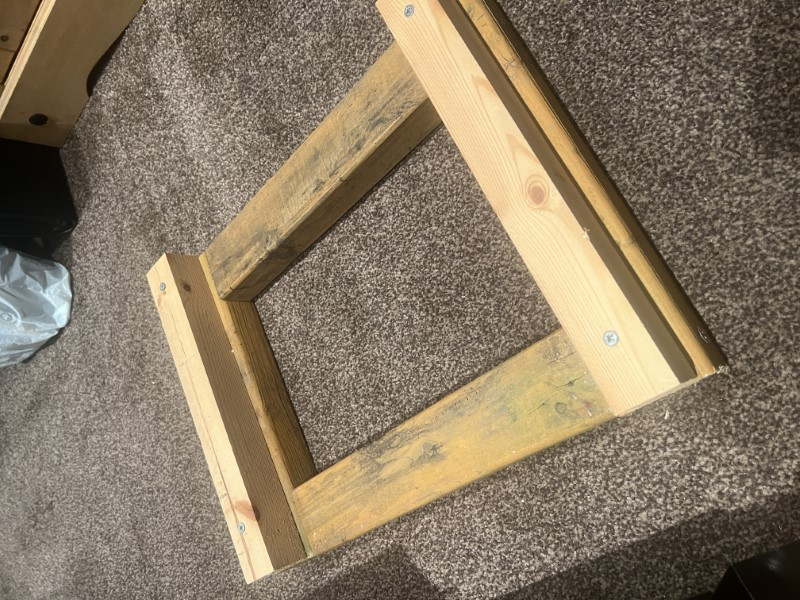

### Introduction

When transporting the loco the battery should be disconnected, this is done for a number of reasons

- To stop the battery shorting on the metal sides of the loco 
- To aid in lifting of the loco in and out of the vehicle 

### Loco Stand

The loco stand should be used to transport the engine, this can be placed in the boot of the car and the engine placed on top, this will stop the engine moving around in the car during transportation. 

